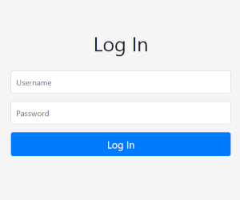

# Portfolio 2.0
When I want to update my personal portfolio (hosted on Github), I have to edit the html file itself. To make this process easier, I build a web app with a database around it. 

Portfolio 2.0 loads the projects info completely dynamically on the index page. There's an admin dashboard to manage project information. 

1. [Setup & Run the application](#setup)
2. [Demo](#demo)
3. [Future](#future)

<a name="setup"></a>
## 1. Setup & Run the application
Use the requirements file to install the necessary dependencies.
```
pip install -r requirements.txt
```
Setup a database. Currently, a mysql database connection is defined. The quickest solution is to replace it with the commented sqlite connection in *app/config.py*. Next, build the database tables.
```
python
from app import db
db.create_all()
exit()
```
Run the application and open up localhost on port 5000 in a web browser.
```
python run.py
```

<a name="demo"></a>
## 2. Demo

### 2.1 Authentication
To make sure only an admin has access to the dashboard, an authentication system is added with client & server side input validation, csrf protection. A new user is easily added with the *add_user.py* script.

<!-- -->

<p align="center">
      
  
</p>

### 2.2 Projects
It's possible to add, update and delete projects. Besides the normal project info such as title, description, image, hyperlink, overlay info and time stamps, it's also possible to hide and order projects. Hidden projects are projects that aren't visible to the public on the index *(portfolio)* web page. These hidden projects are indicated with an orange-ish color in the projects dashboard.

To order projects, a **drag & drop functionality** is implemented with an AJAX call in the background to update the database. This makes it very easy to reorder projects.


<a name="future"></a>
### 3. Future
- Add stats to the main dashboard page such as #projects, #page visits, ...
- Notify people who want to get an email when a new project is published.
- ... ?
